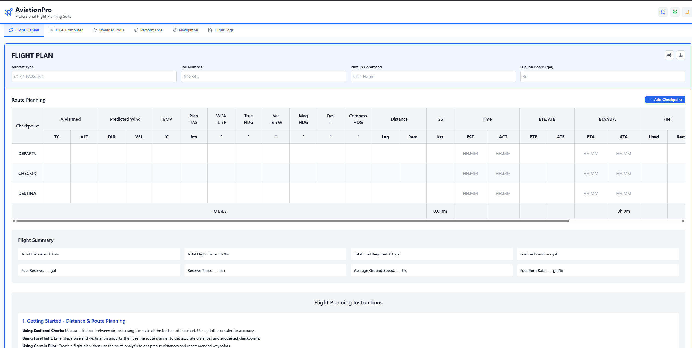
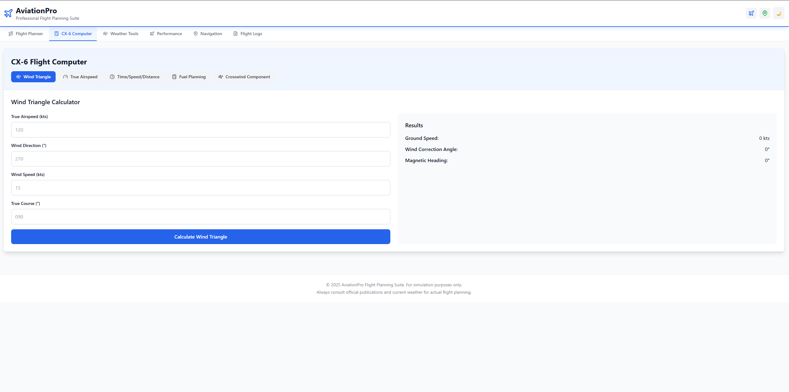
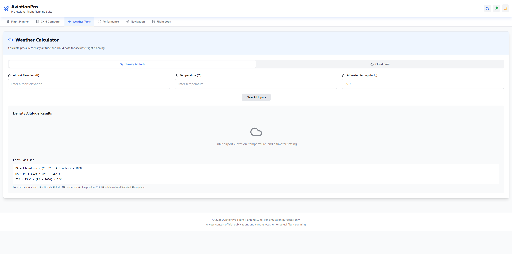
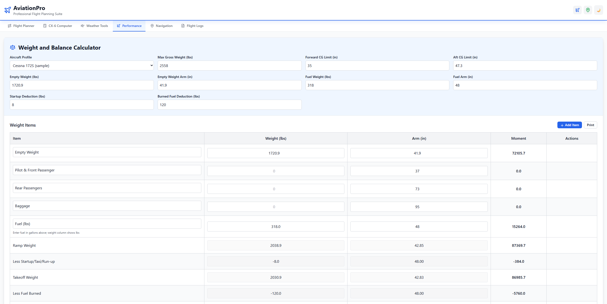
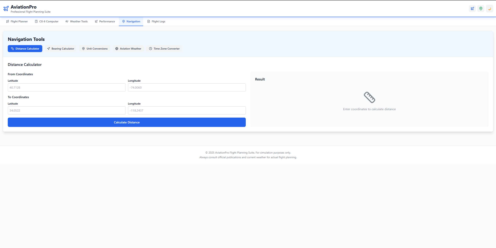
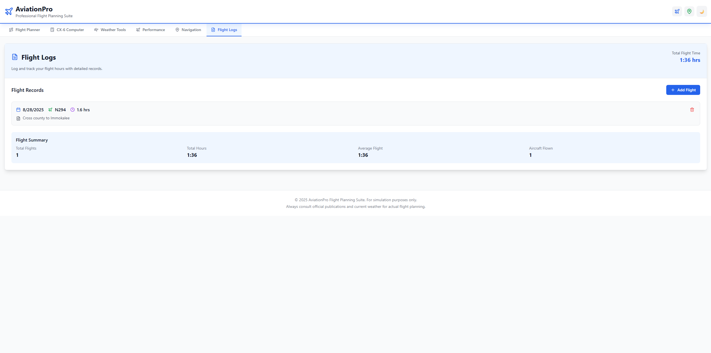

# AviationPro — Professional Flight Planning Suite

A comprehensive aviation flight planning application built with React, TypeScript, and Tailwind CSS. Designed for pilots to plan, calculate, and manage all aspects of flight operations with professional-grade tools and calculations.

## 🚀 Features

### 📋 Flight Planner
- **Complete Flight Documentation**: Aircraft type, tail number, pilot info, fuel planning
- **Dynamic Route Planning**: Add/remove checkpoints with automatic numbering
- **Advanced Flight Calculations**: Distance, course, ground speed, time, and fuel consumption
- **Comprehensive Instructions**: 8-section detailed guide covering all aspects of flight planning
- **VOR Navigation Setup**: Frequency, radial, and identifier configuration
- **Export Options**: Print and download flight plans with professional formatting
- **Real-time Totals**: Automatic calculation of total distance, time, and fuel
- **Manual vs Digital Methods**: Support for both CX-6 and manual E6B calculations

### 🧮 CX-6 Flight Computer
- **Wind Triangle Calculations**: Headwind, crosswind, and tailwind components
- **Fuel Calculations**: Trip fuel, reserve fuel, and endurance times
- **Time-Speed-Distance**: TAS, GS, distance, and time calculations
- **Pressure Altitude**: Field elevation to pressure altitude conversion
- **Density Altitude**: Performance calculations for high-altitude airports
- **Multiple Calculator Modes**: Wind triangle, TAS, fuel consumption, time-speed-distance

### 🌤️ Weather Calculator
- **Density Altitude**: Pressure altitude and density altitude calculations
- **Cloud Base**: Temperature/dew point cloud base approximations
- **Performance Warnings**: Color-coded alerts for high density altitude conditions
- **ISA Deviations**: Temperature variance from standard atmosphere
- **Units Support**: Celsius for temperature, proper aviation units
- **Tabbed Interface**: Easy switching between density altitude and cloud base calculations

### ⚖️ Weight & Balance
- **Aircraft Loading**: Pilot, passengers, fuel, and cargo weights
- **Center of Gravity**: CG envelope calculations and limits
- **Moment Calculations**: Weight × arm calculations
- **Safety Alerts**: Out-of-limits warnings and recommendations

### 🧭 Navigation Tools
- **Distance Calculations**: Great circle and rhumb line distances
- **Bearing Calculations**: True and magnetic bearings
- **Unit Conversions**: Nautical miles, statute miles, kilometers
- **Coordinate Conversions**: Lat/lon to various formats
- **Multiple Calculation Methods**: Haversine formula for accurate results
- **Aviation Weather Services**: Direct links to official weather sources
- **Time Zone Converter**: UTC to local time conversions for international flights

### 📝 Flight Logs
- **Digital Logbook**: Complete flight logging with local storage
- **Flight Details**: Date, aircraft, route, times, and conditions
- **Automatic Calculations**: Block time, flight time, fuel used
- **Export Capabilities**: Download flight logs for records
- **Persistent Storage**: Data saved locally for future sessions

## 🛠️ Technology Stack

- **Frontend**: React 18 with TypeScript
- **Styling**: Tailwind CSS with dark mode support
- **Icons**: Lucide React
- **Build Tool**: Vite
- **State Management**: React hooks
- **Data Persistence**: Local storage for flight logs
- **Development**: Hot module replacement, fast refresh

## 🚀 Quick Start

### Prerequisites
- Node.js v18+ recommended
- npm or yarn package manager

### Installation

```powershell
# Clone or navigate to project directory
cd 'C:\Users\User\Documents\Bolt_ai\Aviation'

# Install dependencies
npm install

# Start development server
npm run dev
```

### Access Application
# AviationPro — Professional Flight Planning Suite

A modern, professional-grade aviation flight planning app for pilots, built with React, TypeScript, and Tailwind CSS.

---

## ✈️ Screenshots


<div align="center">


<br><sub>Flight Planner — route, checkpoints, and calculations</sub>


<br><sub>CX-6 Flight Computer — wind, TAS, fuel, and more</sub>


<br><sub>Weather Tools — density altitude, cloud base, warnings</sub>


<br><sub>Weight & Balance — CG envelope, safety alerts</sub>


<br><sub>Navigation Tools — distance, bearing, conversions, weather links</sub>


<br><sub>Flight Logs — digital logbook with export and persistent storage</sub>

</div>

---

## 🚀 Features

- **Flight Planner:** Dynamic route planning, VOR setup, export options
- **CX-6 Flight Computer:** Wind triangle, fuel, TAS, time/distance
- **Weather Tools:** Density altitude, cloud base, performance warnings
- **Weight & Balance:** CG envelope, safety alerts
- **Navigation Tools:** Distance, bearing, unit/coordinate conversions, weather links, time zone converter
- **Flight Logs:** Digital logbook with export and persistent storage

---

## 🛠️ Tech Stack

- React 18 + TypeScript
- Tailwind CSS (dark mode)
- Vite
- Lucide React icons

---

## 🚀 Quick Start

```sh
git clone https://github.com/robfernan/AviationPro.git
cd AviationPro
npm install
npm run dev
```
Open [http://localhost:5173](http://localhost:5173) in your browser.

---

## 📦 Build

```sh
npm run build
npm run preview
```

---

## 📄 License

This project is for flight simulation and training. Always consult official aviation publications and current weather for actual flight planning.

Built with ❤️ for aviation professionals and enthusiasts.

---

_For detailed usage, troubleshooting, and enhancement roadmap, see the [Wiki](https://github.com/robfernan/AviationPro/wiki)._ 
3. View pressure altitude, density altitude, and ISA deviations
